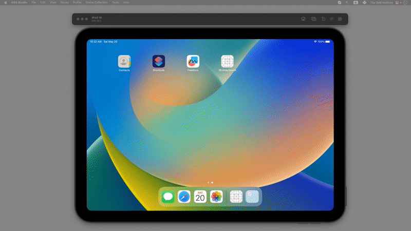

# 2D Array Component Search

A SwiftUI application that visualizes the algorithm for searching a specific word within a 2D grid of characters.

## Overview

This project demonstrates a visual search algorithm on a 10x10 grid. The application searches for the target word **"rafa"** by scanning the grid cell by cell. 

## Features

- **Visual Feedback**:
  - 🟧 **Orange**: Currently scanning/testing a cell.
  - 🟦 **Blue**: Found a partial match (letter matches the sequence).
  - 🟩 **Green**: Full word found.
  
- **Interactive Search**: 
  - Starts searching from (0,0).
  - Uses asynchronous delays to animate the search progress, making the algorithm easy to follow.

## Tech Stack

- **Language**: Swift
- **Framework**: SwiftUI
- **Architecture**: MVVM (Model-View-ViewModel)

## How to Run

1. Open `TwoD Search/TwoD Search.xcodeproj` in Xcode.
2. Select a simulator (e.g., iPad) or a connected device.
3. Run the application (`Cmd + R`).
4. Press the **Search** button to start the visualization.

## Code Structure

- `ContentView.swift`: Main UI layout.
- `ContentView+Search.swift`: Contains the recursive search logic with `DispatchQueue` for animation.
- `ViewModel.swift`: Manages the grid state and generating the random characters.
- `AppData.swift`: singleton for configuration (Grid size, Target word).